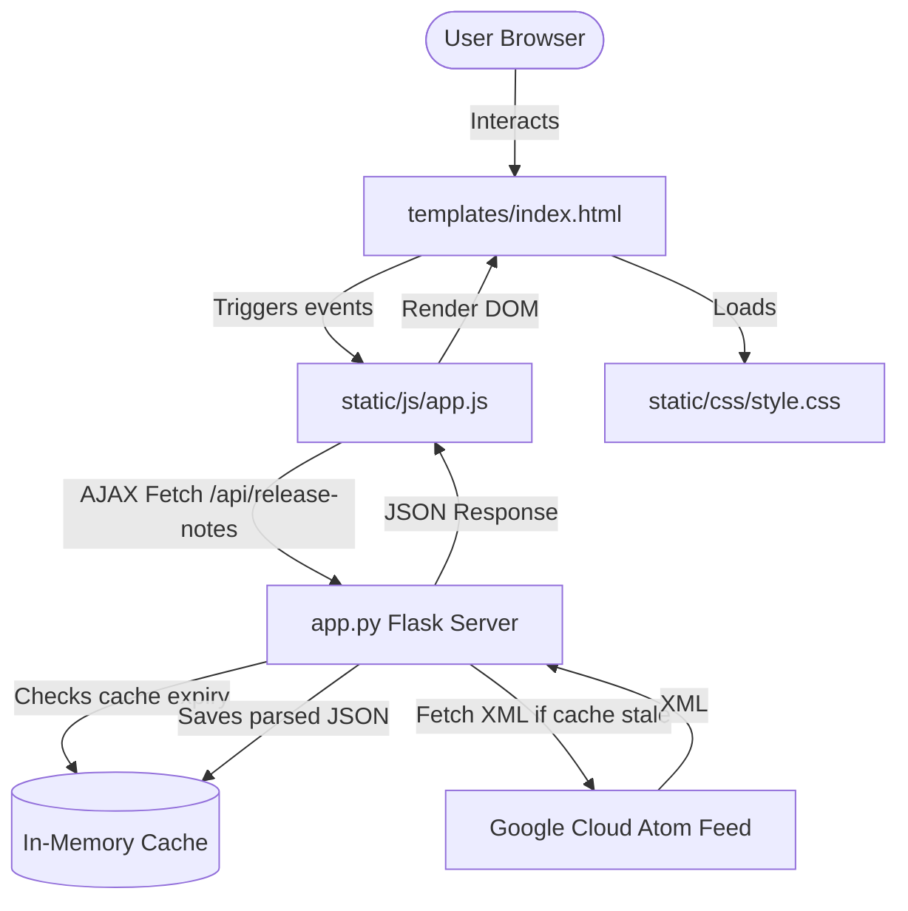

# BigQuery Release Hub 🚀

A modern, responsive Flask web application that fetches, parses, and displays Google Cloud BigQuery release notes in a clean, interactive, and categorized timeline interface.

---

## 📋 Table of Contents
- [Features](#-features)
- [Architecture Diagram](#-architecture-diagram)
- [Tech Stack](#-tech-stack)
- [Project Structure](#-project-structure)
- [Getting Started](#-getting-started)
  - [Prerequisites](#prerequisites)
  - [Installation](#installation)
  - [Running the Server](#running-the-server)
- [API Reference](#-api-reference)

---

## ✨ Features

- **Live Release Feed Parser**: Automatically connects to the official Google Cloud BigQuery Atom feed to retrieve real-time announcements.
- **Granular Splitting**: Segments bulk daily GCP digests into individual, cleanly organized updates categorized by type (e.g. *Feature*, *Change*, *Deprecation*, *Preview*).
- **10-Minute Caching**: Caches raw feed content in-memory (`600` second TTL) to accelerate response times and avoid hitting Google's servers on every reload.
- **Search & Category Filters**: Real-time filtering by category type and interactive full-text search across timestamps and text content.
- **Twitter/X Sharing**: A custom sharing composer that auto-formats your selected update, truncates the message (under the 280-character limit), appends tags/links, and redirects using Twitter web intents.
- **Premium Aesthetics**: Features a modern dark theme with smooth gradients, responsive layout panels, loading skeleton shimmers, and micro-animations.

---

## 📐 Architecture Diagram



---

## 🛠️ Tech Stack

* **Backend**: Python 3, Flask
* **Frontend**: Vanilla HTML5, CSS3, JavaScript (ES6)
* **Icons & Fonts**: Google Fonts (Inter, Outfit), FontAwesome

---

## 📂 Project Structure

* **`app.py`**: Core Flask application, in-memory caching mechanism, and XML parsing engine.
* **`templates/index.html`**: Premium layout grid, Twitter composer modal structure, and loading templates.
* **`static/css/style.css`**: Color variables (HSL dark theme), UI styles, transitions, and shimmer loading keyframes.
* **`static/js/app.js`**: API calls, state management, search/filter execution, modal mechanics, and event delegation.

---

## 🚀 Getting Started

### Prerequisites
* Python 3.8+
* `pip` (Python package installer)

### Installation

1. Navigate to the project directory:
   ```bash
   cd agy-cli-projects/bigquery-release-notes-app
   ```

2. (Optional) Create and activate a Python virtual environment:
   ```bash
   python3 -m venv venv
   source venv/bin/activate
   ```

3. Install required Flask dependency:
   ```bash
   pip install Flask
   ```

### Running the Server

Start the application with:
```bash
python app.py
```

* **Note:** By default, the server launches on **port 5001** to avoid macOS AirPlay Receiver port clashes (port 5000).
* Access the app in your browser at `http://localhost:5001`.

---

## 📡 API Reference

### Get Release Notes
Returns the parsed list of release notes.

* **Endpoint:** `GET /api/release-notes`
* **Query Parameters:**
  - `refresh` (optional): Set to `true` to force a cache refresh and query live Google Cloud data.
* **Response Format:**
```json
{
  "success": true,
  "fetched_live": false,
  "last_updated": "2026-06-30 21:51:20",
  "data": [
    {
      "date": "June 25, 2026",
      "updated": "2026-06-25T00:00:00Z",
      "id": "tag:google.com,2026:bigquery-release-notes/123",
      "link": "https://cloud.google.com/bigquery/docs/release-notes",
      "updates": [
        {
          "type": "Feature",
          "content_html": "<p>BigQuery support for XYZ is now generally available...</p>",
          "content_text": "BigQuery support for XYZ is now generally available..."
        }
      ]
    }
  ]
}
```
